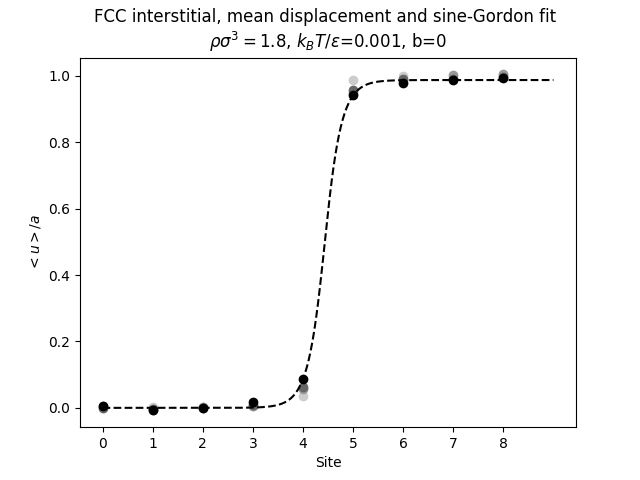

Hertz potential BCC interstitial

</img>

Hertz potential FCC interstitial

</img>

Hertz potential Hexagonal vacancy

</img>

Hertz potential Simple Cubic vacancy

</img>

Star potential replication

</img>
